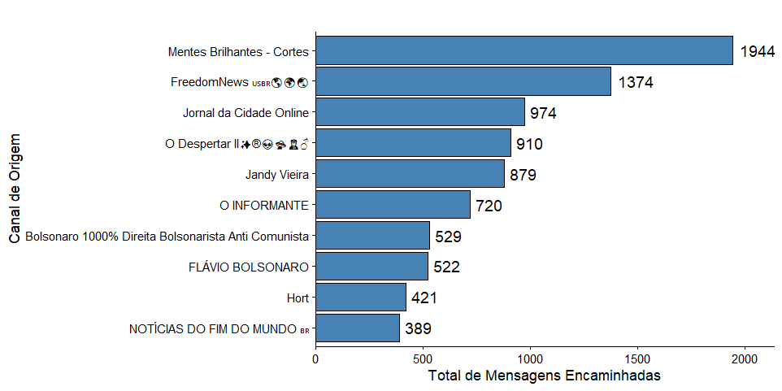
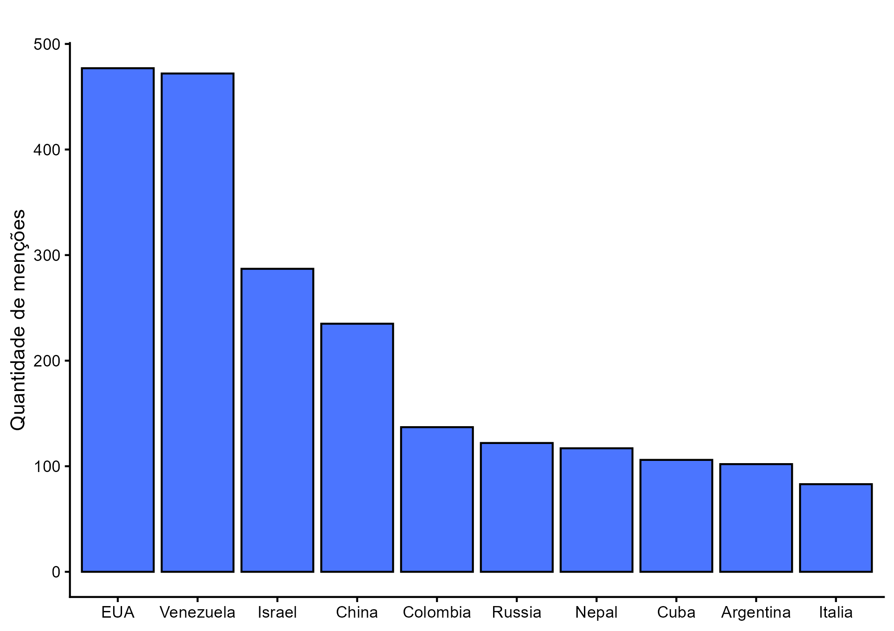
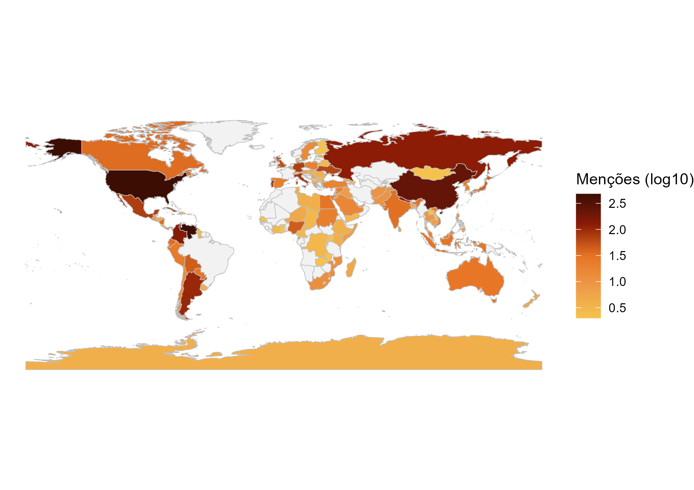
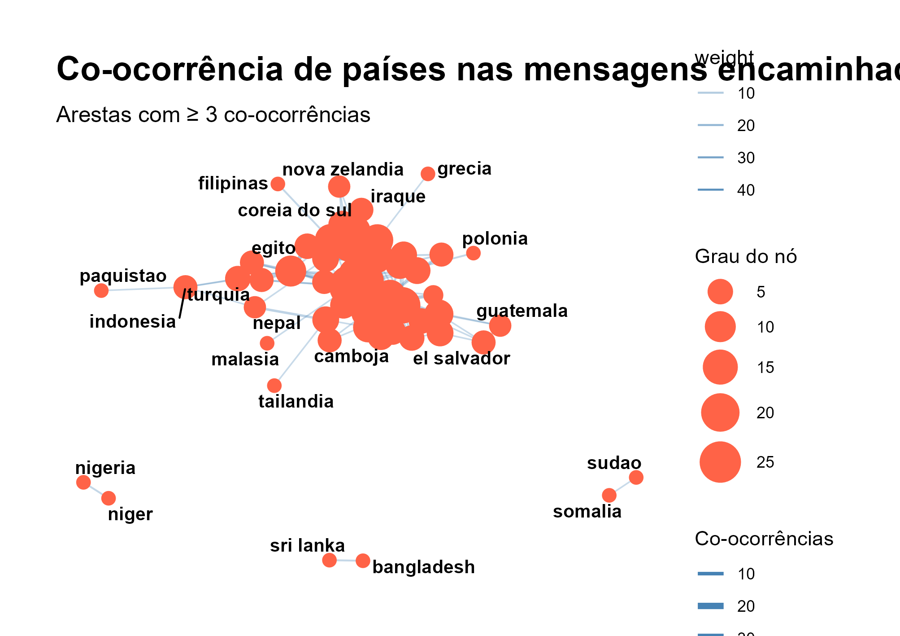
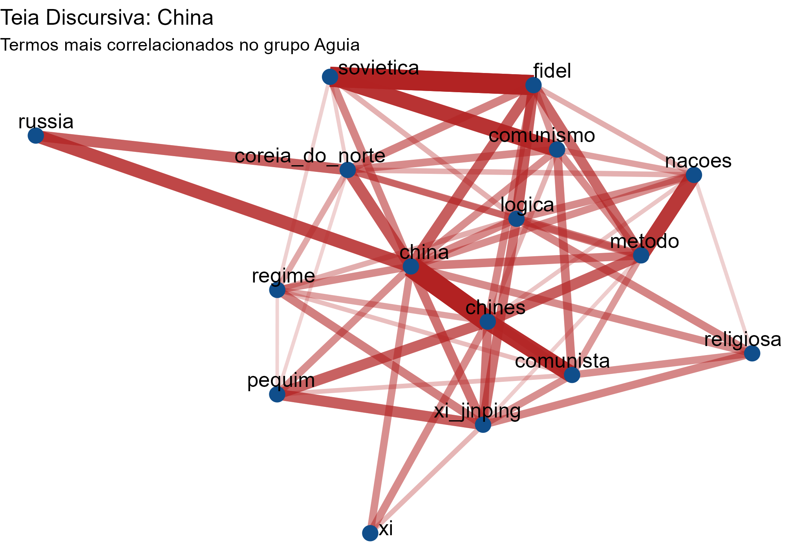
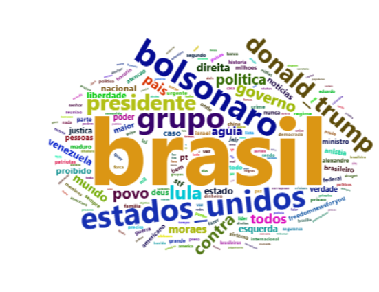
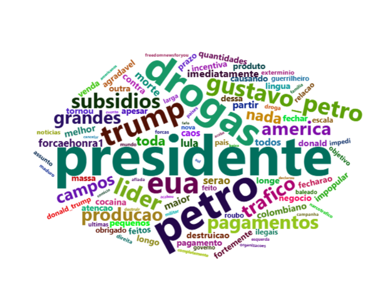

# ALAS_2026
Trabalho enviado para GT 04 do Congresso ALAS em 2026, intitulado "Países no repertório da extrema direita brasileira no Telegram". 
Autores:
Julia Griesbach Targino Flores
Luiza Arruda Guedes
Lucas Jaime Andrade Oliveira


## Apresentação

Este relatório documenta o pipeline de análise das mensagens encaminhadas nos grupos de Telegram selecionados, utilizando como exemplo o grupo **Águia**, cobrindo o período de **setembro a novembro de 2025**. O objetivo é mapear os canais de origem das mensagens, identificar os países mais mencionados, visualizar co-ocorrências geopolíticas e explorar as redes discursivas do grupo por meio de grafos e nuvens de palavras.

O código completo está disponível no repositório do GitHub (link). Este documento serve como relato metodológico reproduzível, podendo ser consultado em conjunto com os scripts `.R` originais.

---
## Estrutura do diretório 
Descrição das pastas e arquivos

dados/Telegram/
Contém os históricos exportados de três grupos do Telegram no formato JSON nativo da plataforma, organizados por grupo e mês. Os arquivos result.json são gerados diretamente pela função de exportação do Telegram e não estão disponíveis neste repositório por razões éticas e de privacidade — os dados brutos de conversas não são compartilhados publicamente.

rdocs/source/
Arquivos R auxiliares carregados via source() nos scripts principais:


stopwords.R — lista de stopwords em português utilizada na filtragem de tokens durante a análise textual
tabela_paises_codigos.R — tabela de referência com nomes de países em português e seus respectivos códigos ISO 3166-1 alfa-3, usada tanto na detecção de menções quanto no join com as geometrias do mapa

rdocs/
01_telegramr_aguiaencaminhadas.R
Script de análise do Grupo Águia (setembro–novembro de 2025). Cobre o pipeline completo: leitura e consolidação dos JSONs mensais, filtragem de mensagens encaminhadas, extração e contagem de países citados, geração de mapa coroplético, grafo de co-ocorrência entre países, teia discursiva por palavra-chave e nuvens de palavras gerais e por país.

02_telegramr_forcaehonraencaminhadas.R
Script de análise do Grupo FORÇA & HONRA chat, com estrutura análoga ao script do Águia.

03_telegramr_acordabrasilencaminhadas.R
Script de análise do Grupo Acorda Brasil (setembro–novembro de 2025), igualmente estruturado.


## Dados

### Origem

Os dados foram exportados diretamente do aplicativo Telegram, utilizando a função nativa de exportação de histórico de grupo no formato **JSON**. Cada arquivo `result.json` corresponde a um mês de mensagens e contém uma lista de objetos sob a chave `"messages"`.

### Estrutura do JSON

Cada mensagem exportada pelo Telegram pode conter os seguintes campos relevantes para esta análise:

| Campo            | Descrição                                                       |
|------------------|-----------------------------------------------------------------|
| `id`             | Identificador único da mensagem                                 |
| `date`           | Data e hora no formato `YYYY-MM-DDTHH:MM:SS`                   |
| `text`           | Conteúdo da mensagem (pode ser string ou lista de objetos)      |
| `forwarded_from` | Canal ou usuário de origem, quando a mensagem foi encaminhada   |

> **Nota sobre o campo `text`:** O Telegram pode exportar o texto como uma string simples ou como uma lista de objetos (quando há menções, links ou formatação especial). Por isso, é necessário achatar esse campo com `map_chr(..., ~ paste(unlist(.x), collapse = " "))` antes de qualquer análise textual.

---

## Pipeline

### Pacotes utilizados

```r
if (!require(pacman)) install.packages("pacman")
p_load(
  tidyverse, tidytext, tidyr, dplyr, ggplot2, stringr,
  jsonlite, purrr, stringi, tidylog, widyr, igraph, ggraph,
  sf, countries, rnaturalearth, rnaturalearthdata,
  viridis, tmap, writexl, gt, MetBrewer, tibble, wordcloud2
)
```

Os principais pacotes e seus papéis no pipeline:

- **`tidyverse` / `tidytext`** — manipulação de dados e tokenização de texto
- **`jsonlite`** — leitura dos arquivos JSON exportados pelo Telegram
- **`stringi`** — normalização de strings (remoção de acentos via transliteração Latin-ASCII)
- **`widyr`** — cálculo de co-ocorrências e correlações entre pares de palavras/países
- **`igraph` / `ggraph`** — construção e visualização de grafos
- **`rnaturalearth`** — geometrias dos países para o mapa coroplético
- **`MetBrewer`** — paletas de cores para figuras
- **`wordcloud2`** — nuvens de palavras interativas

### Função auxiliar de exportação de figuras

```r
seed <- 2000

salvar_figura <- function(nome_arquivo, plot = last_plot(),
                          largura = 17, altura = 12, unidade = "cm") {
  ggsave(
    filename = paste0("figuras/aguia/", nome_arquivo, ".png"),
    plot     = plot,
    width    = largura,
    height   = altura,
    units    = unidade,
    dpi      = 300,
    bg       = "white"
  )
}
```

A função `salvar_figura()` padroniza a exportação: todas as figuras são salvas em `figuras/aguia/` com dimensões de 17×12 cm e resolução de 300 dpi — padrão adequado para publicação acadêmica (ABNT).

---

### Leitura e consolidação dos dados

```r
aguia_setembro <- fromJSON("Dados/Telegram/Grupo - Águia/Setembro/result.json") %>%
  .[["messages"]] %>%
  select(any_of(c("id", "date", "text", "forwarded_from")))

aguia_outubro <- fromJSON("Dados/Telegram/Grupo - Águia/Outubro/result.json") %>%
  .[["messages"]] %>%
  select(any_of(c("id", "date", "text", "forwarded_from")))

aguia_novembro <- fromJSON("Dados/Telegram/Grupo - Águia/Novembro/result.json") %>%
  .[["messages"]] %>%
  select(any_of(c("id", "date", "text", "forwarded_from")))

aguia <- bind_rows(aguia_setembro, aguia_outubro, aguia_novembro)

rm(aguia_setembro, aguia_outubro, aguia_novembro)
```

Os três arquivos mensais são lidos individualmente e consolidados em um único data frame (`aguia`) via `bind_rows()`. Usa-se `any_of()` para selecionar apenas os campos relevantes — o que evita erros caso algum mês não contenha todos os campos esperados. Os objetos intermediários são removidos para liberar memória.

---

### Pré-processamento e filtragem

```r
PAISES_EXCLUIR <- c("brasil", "reuniao", "irao", "malta")

mensagens_encaminhadas <- aguia %>%
  mutate(texto_limpo = map_chr(text, ~ paste(unlist(.x), collapse = " "))) %>%
  filter(!is.na(forwarded_from)) %>%
  filter(str_squish(texto_limpo) != "") %>%
  mutate(
    date        = as.POSIXct(date, format = "%Y-%m-%dT%H:%M:%S"),
    texto_limpo = tolower(texto_limpo),
    texto_limpo = stri_trans_general(texto_limpo, "Latin-ASCII")
  )

rm(aguia)
```

Esta etapa realiza quatro operações principais:

1. **Achatamento do campo `text`:** como mencionado, o JSON pode trazer o texto como lista; `map_chr(text, ~ paste(unlist(.x), collapse = " "))` garante que o resultado seja sempre uma string.
2. **Filtragem de mensagens encaminhadas:** `filter(!is.na(forwarded_from))` mantém apenas as mensagens que vieram de outro canal, que são o objeto de interesse da análise.
3. **Remoção de mensagens vazias:** após o achatamento, mensagens sem conteúdo textual são descartadas com `str_squish()`.
4. **Normalização do texto:** conversão para minúsculas e remoção de acentos via `stri_trans_general(..., "Latin-ASCII")`, o que facilita a correspondência com o vetor de países.

> A constante `PAISES_EXCLUIR` lista termos que são palavras de países mas que, no contexto deste corpus, aparecem com outro significado ou causam ruído: "brasil" (onipresente, não informativo), "reuniao" (falso positivo de "Reunião"), "irao" (falso positivo de "irão" vs. verbo), "malta" (nome de Magno Malta, que estava causando ruído).

---

### Análise 1 — Top canais de origem

```r
mensagens_encaminhadas %>%
  count(forwarded_from, name = "total_encaminhamentos", sort = TRUE) %>%
  head(10) %>%
  mutate(forwarded_from = reorder(forwarded_from, total_encaminhamentos)) %>%
  ggplot(aes(x = total_encaminhamentos, y = forwarded_from)) +
  geom_col(fill = "steelblue", color = "black") +
  geom_text(aes(label = total_encaminhamentos), hjust = -0.2, size = 4) +
  labs(
    x = "Total de Mensagens Encaminhadas",
    y = "Canal de Origem"
  ) +
  theme_classic() +
  scale_x_continuous(expand = expansion(mult = c(0, 0.1)))
```

O gráfico de barras horizontais exibe os dez canais que mais contribuíram com mensagens encaminhadas para o grupo. A ordenação pelo volume facilita a leitura comparativa. `reorder()` garante que o eixo Y seja apresentado em ordem crescente de baixo para cima — convenção visual padrão para gráficos de barras horizontais.

<figure>

<figcaption aria-hidden="true"><em>Exemplo de Gráfico de Barras com os 10 canais mais encaminhados no Grupo Águia</em></figcaption>
</figure>

---

### Análise 2 — Menções a países

#### Preparação do vetor de países

```r
source("rdocs/source/tabela_paises_codigos.r")

paises_limpos <- stri_trans_general(paises_tabela$pais, "Latin-ASCII")
paises_limpos <- str_to_lower(paises_limpos)

padrao_busca_paises <- paste0("\\b(", paste(paises_limpos, collapse = "|"), ")\\b")

mensagens_encaminhadas_paises <- mensagens_encaminhadas %>%
  mutate(
    texto_buscavel = stri_trans_general(str_to_lower(texto_limpo), "Latin-ASCII")
  ) %>%
  filter(str_detect(texto_buscavel, padrao_busca_paises))
```

O arquivo `tabela_paises_codigos.r`, envelopado em uma pasta separada chamada de "source", fornece um data frame `paises_tabela` com colunas `pais` (nome em português) e `iso3` (código ISO 3166-1 alfa-3). Os nomes são normalizados (sem acentos, minúsculas) e concatenados em uma **expressão regular com fronteiras de palavra** (`\b...\b`), garantindo que "catar" detecte o termo isolado mas não "catarina". Apenas as mensagens que contêm ao menos um país são mantidas.

#### Contagem e gráfico dos países mais citados

```r
contagem_paises <- mensagens_encaminhadas_paises %>%
  mutate(pais_citado = str_extract_all(texto_buscavel, padrao_busca_paises)) %>%
  unnest(pais_citado) %>%
  filter(!pais_citado %in% PAISES_EXCLUIR) %>%
  count(pais_citado, name = "total_mencoes", sort = TRUE)

write_xlsx(contagem_paises, "paises_mais_citados_grupoaguia.xlsx")

contagem_paises %>%
  slice_max(order_by = total_mencoes, n = 10) %>%
  mutate(pais_citado = reorder(pais_citado, total_mencoes, decreasing = TRUE)) %>%
  ggplot(aes(y = total_mencoes, x = pais_citado)) +
  geom_col(fill = "#4B75FF", color = "black") +
  scale_x_discrete(
    labels = function(x) {
      x <- str_to_title(x)
      str_replace(x, "Estados Unidos", "EUA")
    }
  ) +
  theme_classic() +
  labs(x = NULL, y = "Quantidade de menções")

salvar_figura("aguia_top10_paises")
```

`str_extract_all()` retorna uma lista com todos os países encontrados em cada mensagem; `unnest()` expande essa lista em linhas individuais, permitindo contar cada menção separadamente. A contagem é exportada em `.xlsx` para consulta e também visualizada no gráfico dos 10 países mais citados.

<figure>

<figcaption aria-hidden="true"><em>Exemplo de Gráfico de Barras com os 10 canais mais encaminhados no Grupo Águia</em></figcaption>
</figure>

---

### Análise 3 — Mapa mundial de menções

```r
contagem_com_iso <- contagem_paises %>%
  left_join(
    paises_tabela %>%
      mutate(
        pais_join = stri_trans_general(pais, "Latin-ASCII"),
        pais_join = str_to_lower(pais_join)
      ),
    by = c("pais_citado" = "pais_join")
  ) %>%
  mutate(iso3 = str_to_upper(iso3))

mapa_mundo <- ne_countries(scale = "medium", returnclass = "sf")

mapa_dados <- mapa_mundo %>%
  left_join(contagem_com_iso, by = c("iso_a3" = "iso3"))

ggplot(data = mapa_dados) +
  geom_sf(aes(fill = log10(total_mencoes + 1)), color = "gray", size = 0.2) +
  scale_fill_gradientn(
    colors   = met.brewer("Greek", direction = -1),
    na.value = "gray95"
  ) +
  theme_void() +
  labs(fill = "Menções (log10)")

salvar_figura("aguia_mapa")

rm(contagem_com_iso, mapa_mundo, mapa_dados)
```
<figure>

<figcaption aria-hidden="true"><em>Mapa coroplético com países citados no Grupo Águia</em></figcaption>
</figure>


Para o mapa coroplético, as contagens são vinculadas ao código ISO3 de cada país via `left_join()`. As geometrias vêm do pacote `rnaturalearth`. A escala de cores usa transformação logarítmica (`log10(total_mencoes + 1)`) para suavizar a diferença entre países muito e pouco citados, e a paleta "Greek" do `MetBrewer` garante visual adequado para publicação.


---

### Análise 4 — Grafo de co-ocorrência entre países

```r
pares_paises <- mensagens_encaminhadas_paises %>%
  mutate(
    paises = map(
      texto_buscavel,
      ~ str_extract_all(.x, padrao_busca_paises)[[1]] %>%
        unique() %>%
        .[!. %in% PAISES_EXCLUIR]
    )
  ) %>%
  filter(map_int(paises, length) >= 2) %>%
  select(id_msg = id, paises) %>%
  unnest(paises) %>%
  rename(pais = paises) %>%
  pairwise_count(pais, id_msg, sort = TRUE, upper = FALSE)

min_coocorrencias <- 3

grafo_paises <- pares_paises %>%
  filter(n >= min_coocorrencias) %>%
  graph_from_data_frame(directed = FALSE)

E(grafo_paises)$weight <- pares_paises %>%
  filter(n >= min_coocorrencias) %>%
  pull(n)

V(grafo_paises)$grau <- degree(grafo_paises)

set.seed(seed)
ggraph(grafo_paises, layout = "fr") +
  geom_edge_link(aes(width = weight, alpha = weight), color = "steelblue") +
  geom_node_point(aes(size = grau), color = "tomato") +
  geom_node_text(aes(label = name), repel = TRUE, size = 3.5, fontface = "bold") +
  scale_edge_width(range = c(0.4, 3)) +
  scale_edge_alpha(range = c(0.3, 0.9)) +
  scale_size(range = c(3, 10)) +
  labs(
    title    = "Co-ocorrência de países nas mensagens encaminhadas",
    subtitle = paste0("Arestas com ≥ ", min_coocorrencias, " co-ocorrências"),
    size     = "Grau do nó",
    edge_width = "Co-ocorrências"
  ) +
  theme_graph(base_family = "sans")

salvar_figura(paste0("aguia_coocorrencia_paises"))

write_xlsx(pares_paises, "coocorrencia_paises_grupoaguia.xlsx")
```
<figure>

<figcaption aria-hidden="true"><em>Grafo de co-ocorrência
</em></figcaption>
</figure>

O grafo é construído a partir de **pares não-ordenados de países** que co-ocorrem na mesma mensagem. `pairwise_count()` (do pacote `widyr`) faz essa contagem eficientemente. O threshold `min_coocorrencias = 3` filtra pares raros, deixando apenas relações com alguma consistência no corpus. No grafo resultante:

- O **tamanho dos nós** é proporcional ao grau (quantos outros países aquele país aparece junto)
- A **espessura das arestas** é proporcional à frequência de co-ocorrência
- O layout Fruchterman-Reingold (`"fr"`) posiciona países com mais co-ocorrências mais próximos entre si

---

### Análise 5 — Teia discursiva por palavra-chave

```r
# Pré-processamento com entidades multi-palavras
palavras_compostas <- c(
  "estados unidos", "coreia do norte", "coreia do sul", "reino unido",
  "arabia saudita", "emirados arabes", "africa do sul", "nova zelandia",
  "papua nova guine", "guinea bissau", "burkina faso", "serra leoa",
  "costa do marfim", "republica tcheca", "republica dominicana",
  "trinidad e tobago", "bosnia herzegovina", "timor leste",
  "joe biden", "donald trump", "habeas corpus", "marco rubio",
  "guine equatorial", "greta thunberg", "benjamin netanyahu",
  "xi jinping", "gustavo petro", "miguel uribe"
)

colapsar_palavras <- function(texto) {
  texto_norm <- texto %>%
    str_to_lower() %>%
    stri_trans_general("Latin-ASCII")
  for (palavras in palavras_compostas) {
    padrao    <- str_replace_all(palavras, " ", "\\\\s+")
    slug      <- str_replace_all(palavras, " ", "_")
    texto_norm <- str_replace_all(texto_norm, padrao, slug)
  }
  texto_norm
}

source("rdocs/source/stopwords.r")
if (is.data.frame(stopwords_pt)) {
  stopwords_pt <- stopwords_pt[[intersect(c("word", "palavra"), names(stopwords_pt))[1]]]
} else {
  stopwords_pt <- unlist(stopwords_pt, use.names = FALSE)
}
stopwords_pt <- stopwords_pt %>%
  as.character() %>% str_to_lower() %>%
  stri_trans_general("Latin-ASCII") %>%
  str_squish() %>% unique()

palavras_limpas <- mensagens_encaminhadas_paises %>%
  mutate(
    id_mensagem   = row_number(),
    texto_tratado = colapsar_palavras(texto_limpo)
  ) %>%
  unnest_tokens(palavra, texto_tratado) %>%
  filter(!palavra %in% stopwords_pt) %>%
  filter(str_detect(palavra, "^[a-z_çáàãâéêíóôõú]+$")) %>%
  mutate(palavra = case_when(
    palavra == "americanos"  ~ "americano",
    palavra == "americanas"  ~ "americana",
    palavra == "eua"         ~ "estados_unidos",
    palavra == "trump"       ~ "donald_trump",
    palavra == "palestinos"  ~ "palestino",
    palavra == "israelenses" ~ "israelense",
    palavra == "netanyahu"   ~ "benjamin_netanyahu",
    palavra == "greta"       ~ "greta_thunberg",
    palavra == "petro"       ~ "gustavo_petro",
    palavra %in% c("chines", "chineses", "chinesa", "chinesas") ~ "chines",
    .default = palavra
  ))

correlacao_palavras <- palavras_limpas %>%
  group_by(palavra) %>%
  filter(n() >= 10) %>%
  ungroup() %>%
  pairwise_cor(item = palavra, feature = id_mensagem, sort = TRUE)

# Ajustar `palavra` e `palavra_titulo` para trocar o foco
palavra       <- "estados_unidos"
palavra_titulo <- "Estados Unidos"

palavras_alvo <- correlacao_palavras %>%
  filter(item1 == palavra) %>%
  top_n(15, correlation) %>%
  pull(item2)

palavras_grafo <- c(palavra, palavras_alvo)

dados_grafo <- correlacao_palavras %>%
  filter(item1 %in% palavras_grafo, item2 %in% palavras_grafo) %>%
  filter(correlation > 0.05) %>%
  graph_from_data_frame()

set.seed(seed)
ggraph(dados_grafo, layout = "fr") +
  geom_edge_link(aes(edge_alpha = correlation, edge_width = correlation),
                 edge_colour = "firebrick", show.legend = FALSE) +
  geom_node_point(color = "dodgerblue4", size = 4) +
  geom_node_text(aes(label = name), vjust = 1, hjust = 1, size = 4.5, repel = TRUE) +
  theme_void() +
  labs(
    title    = paste0("Teia Discursiva: ", palavra_titulo),
    subtitle = "Termos mais correlacionados no grupo Águia"
  )

salvar_figura(paste0("aguia2_teia_discursiva_", palavra))
```
<figure>

<figcaption aria-hidden="true"><em>Teia Discursiva - China
</em></figcaption>
</figure>

A teia discursiva mapeia os **termos mais correlacionados** com uma palavra-chave no corpus. O pré-processamento é um pouco mais sofisticado neste bloco - expressões multi-palavra (como "estados unidos", "donald trump") são convertidas em fragmentos de palavras (slugs) utilizando underscores (`estados_unidos`) para serem tratadas como um único token pela tokenização - tokenizar é o processo de separar, neste caso, cada palavra de um texto como uma entidade só. A função `pairwise_cor()` calcula a correlação phi entre todos os pares de palavras que aparecem nas mesmas mensagens. O grafo resultante exibe os 15 termos mais correlacionados com a palavra-alvo, conectados por arestas cuja espessura e transparência refletem a força da correlação. Note que para a imagem de exemplo, utilizamos "china", mas no código mantivemos "estados_unidos" para ilustrar a necessidade do underscore. 

> Para explorar outro termo, basta alterar as variáveis `palavra` e `palavra_titulo` no início do bloco.

---

### Análise 6 — Nuvens de palavras

#### Nuvem geral

```r
freq_geral <- palavras_limpas %>%
  count(palavra, name = "freq", sort = TRUE)

wordcloud2(
  data            = freq_geral %>% head(200),
  size            = 0.6,
  color           = "random-dark",
  backgroundColor = "white"
)
```
<figure>

<figcaption aria-hidden="true"><em>Nuvem de Palavras
</em></figcaption>
</figure>

#### Nuvem por país citado

```r
wordcloud_pais <- function(pais_alvo, top_n = 150) {
  freq <- mensagens_encaminhadas_paises %>%
    mutate(pais_citado = str_extract_all(texto_buscavel, padrao_busca_paises)) %>%
    unnest(pais_citado) %>%
    filter(pais_citado == pais_alvo) %>%
    mutate(texto_limpo = colapsar_palavras(texto_limpo)) %>%
    unnest_tokens(word, texto_limpo) %>%
    mutate(palavra = case_when(
      palavra == "americanos"  ~ "americano",
      palavra == "americanas"  ~ "americana",
      palavra == "eua"         ~ "estados_unidos",
      palavra == "trump"       ~ "donald_trump",
      palavra == "palestinos"  ~ "palestino",
      palavra == "israelenses" ~ "israelense",
      palavra == "netanyahu"   ~ "benjamin_netanyahu",
      palavra == "greta"       ~ "greta_thunberg",
      palavra == "petro"       ~ "gustavo_petro",
      palavra %in% c("chines", "chineses", "chinesa", "chinesas") ~ "chines",
      .default = palavra
    )) %>%
    filter(
      !word %in% stopwords_pt,
      !word %in% str_replace_all(paises_limpos, " ", "_"),
      str_length(word) > 2,
      !str_detect(word, "^[0-9]+$")
    ) %>%
    count(word, name = "freq", sort = TRUE) %>%
    head(top_n)

  if (nrow(freq) == 0) {
    message("Nenhum token encontrado para o país: ", pais_alvo)
    return(invisible(NULL))
  }

  wordcloud2(data = freq, size = 0.5, color = "random-dark", backgroundColor = "white")
}

wordcloud_pais("colombia", top_n = 100)
```

A função `wordcloud_pais()` isola as mensagens que mencionam um país específico e gera uma nuvem de palavras com os termos mais frequentes naquele subconjunto - excluindo stopwords, os próprios nomes de países e tokens numéricos. Isso permite examinar **em que contexto discursivo** cada país é citado no grupo. Para outro país, basta alterar o argumento `pais_alvo`.

<figure>

<figcaption aria-hidden="true"><em>Nuvem de Palavras sobre Colômbia
</em></figcaption>
</figure>

---

## Outputs gerados

| Arquivo | Conteúdo |
|---|---|
| `figuras/aguia/aguia_top10_paises.png` | Gráfico dos 10 países mais citados |
| `figuras/aguia/aguia_mapa.png` | Mapa coroplético mundial de menções |
| `figuras/aguia/aguia_coocorrencia_paises.png` | Grafo de co-ocorrência entre países |
| `figuras/aguia/aguia2_teia_discursiva_*.png` | Teia discursiva por palavra-chave |
| `paises_mais_citados_grupoaguia.xlsx` | Contagem de menções por país em formato Excel|
| `paises_contexto_por_canal_grupoaguia.xlsx` | Cruzamento canal × país com contexto em formato Excel|
| `mensagens_multi_paises_grupoaguia.xlsx` | Mensagens que citam ≥ 2 países em formato Excel|
| `coocorrencia_paises_grupoaguia.xlsx` | Pares de países co-ocorrentes com contagem em formato Excel|

---


